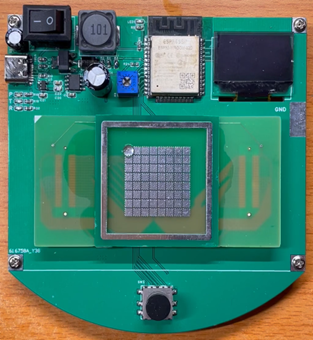

你好，我是谢鑫涛，一名来自华南农业大学的本科生，专业是电子信息科学与技术。在华南农业大学学习的时间里，我加入了华南农业大学科技创新与创业联合会自然科学部实验室（AIE Lab）。在实验室的学习中，参与了涉及互联网和嵌入式系统的研究项目，对于工业机器人，电控，算法和自主导航驾驶有着深厚的兴趣。

### 教育背景

## 项目经历

##### 远程微流控系统（毕业设计）

    

        
    

    

        <a href="_posts/远程微流控系统.md"><b>一种优雅的微小液滴控制技术</b></a> 
        1.对数字液滴微流控技术及远程微流控系统在物联网中的应用进行了背景研究    
        2.基于EWOD (electrowetting on dielectric)和Division & Fusion建立理论框架 
        3.开发了基于ESP32 IoT芯片的远程微流控系统，实现了板载升压、USB供电、菜单接口、串口通信、联网等一系列功能  
        4.利用物联网的新特性，将上位机以HTML形式存储到ESP32芯片上，进一步降低了微流控系统的成本 
        <a href="https://youtube.com/shorts/weA5z-Vz9aQ">[Video]</a>
    

##### 2021年电子设计大赛G题-植保无人机

##### 网箱对靶投饵系统

##### 5G+VR虚拟现实解决方案

##### Small Desktop Display

### 论文发表

##### A 3D Hand Pose Estimation Architecture Based on Depth Camera 

### 校园经历

### 荣誉 & 奖项

- “全国大学生电子设计竞赛”全国一等奖（队长，2021）
- “国家级”大学生创新创业实践计划项目（主持人，2020）
- “全国大学生电子设计竞赛广东省赛”广东省一等奖（队长，2021）
- “广东省汽车与农机电子环保大赛”广东省二等奖（队长，2021）
- “广东省科技创新战略专项资金”省级立项（成员，2020）
- “邦普杯华南农业大学电子设计竞赛”特等奖（队长，2021）
- “创客杯大学生创新创业大赛”银奖（队长，2020）
- “丁颖杯发明创意大赛”一等奖（队员，2020）
- “华南农业大学极客挑战赛新生赛”一等奖（队长，2020年）